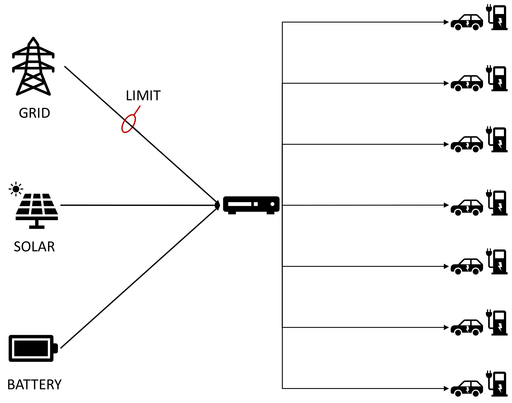

# README #

This is the repository contains all the code, figures and reports, related to the Data Science Project Competition 2024. 

## About the Project ##

As the complexity of systems deployed in real-world applications continues to grow, ensuring explainability of their decision-making processes becomes increasingly important. This overview dives into explanation of the decision-making processes of an electric car charging system managed by Siemens. Optimization of energy usage is crucial in making the grid more sustainable and efficient. We start with an initial dataset exploration, revealing discrepancies between the dataset and provided information about the system. We establish a baseline model on a subset of data, successfuly recovering ground truth rules, governing the grids behavior. Employing two contrasting approaches in the form of deep neural networks and logic tensor networks, we show the importance of fastcharger station power and provide a revised set of rules and thresholds, governing the system. 

## Repository Structure ##

The repository consists of several folders::

* the source folder (`/src`) contains all of the relevant source code used. Instructions on how to run it can be found in the same folder.
* the journal folder (`/journal`) contains loggs of individual contributions
* the interim report folder (`/interim_report`) contains the final version of the interim report. It also includes an image folder (`Figures`), that contains all of the figures, used in the report. Most of the figures were generated with the provided code, some were further modified.
* the final report folder (`/final_report`)
* and the presentation folder (`/presentation`)

`
