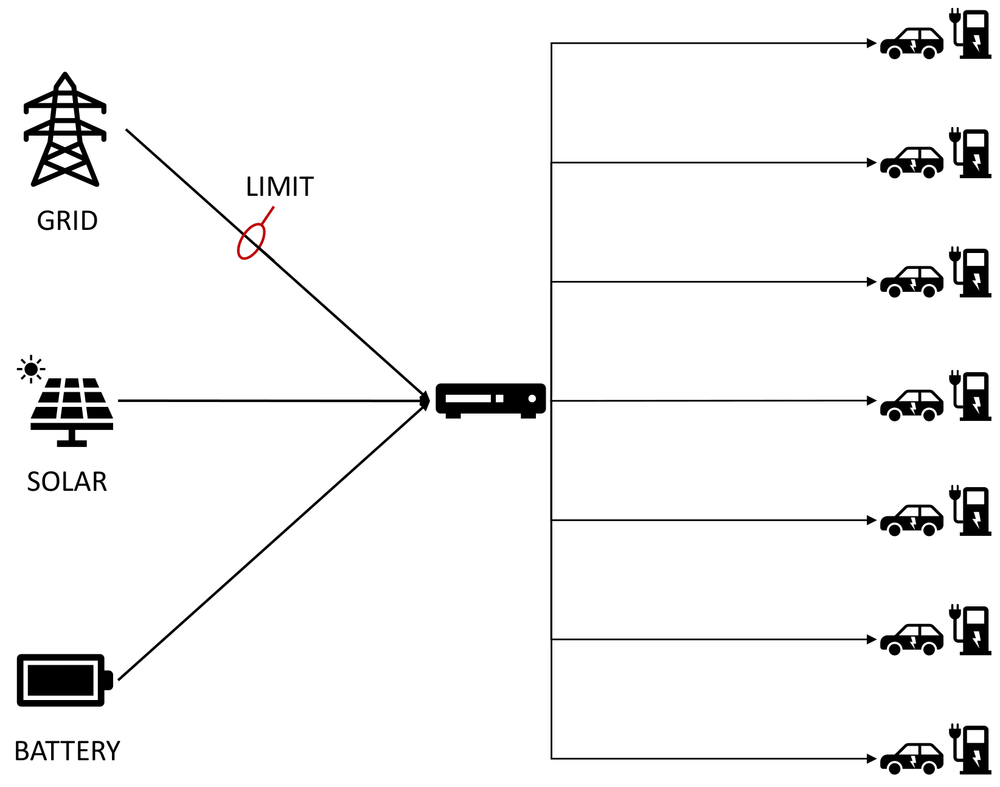

# README #

This is the repository contains all the code, figures and reports, related to the Data Science Project Competition 2024. 

## About the Project ##

The motivation for optimizing energy usage lies in the need
for sustainability, efficiency, and reliability in the energy infrastructure to mitigate climate change and ensure a brighter, greener future. The focus of this project relates to a power grid, which connects electric vehicle charging stations to three different power sources – solar panels, batteries and the public electric grid. Due to limitations of the grid and variable nature of solar power, a system was put in place by Siemens that governs the behavior of the grid and distributes power according to momentary supply and demand. 

However, the almost black box nature of the decision system makes it difficult to further improve and optimize its decision making process. Our goal for this project therefore, is to explain the decision-making process that governs the behavior of the grid. We approach the task by first trying to recover the governing rules from the dataset provided by Siemens. We establish baseline model with which we try to recover the provided ground truths. Next, we look to further expand upon those rules, utilizing neuro-symbolic approaches. Finally, we look for ways to optimize the behavior of the grid via threshold optimization.

## Repository Structure ##

The repository consists of several folders::

* the source folder (`/src`) contains all of the relevan source code used
* the journal folder (`/journal`) contains loggs of individual contributions
* the interim report folder (`/interim_report`) contains the final version of the interim report. It also includes an image folder (`Figures`), that contains all of the figures, used in the report. Most of the figures were generated with the provided code, some were further modified.
* the final report folder (`/final_report`)
* and the presentation folder (`/presentation`)

## Reproducibility ##

Code, provided in the `Code.ipynb` is compatible with Python==3.12. In order to recreate the conda environment, the following commands can be run from the root directory of the repository:

`
conda env create -f environment.yml
`

In order to activate the environment, run the following command:

`
conda activate Project
`